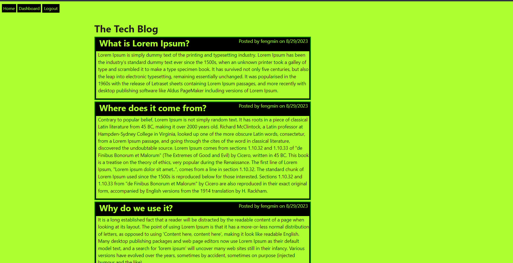
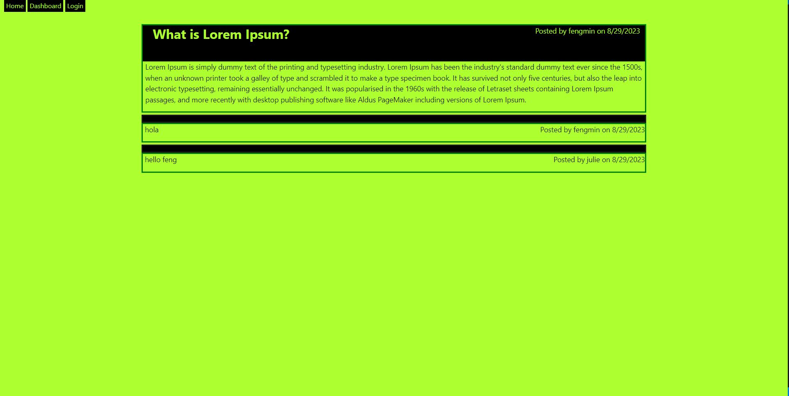

# Tech Blog

## Description

This CMS style blog sites allows developers who write about tech the ability to publish articles, blog posts, their thoughts and opinions.

## Table Of Contents

- [Installation](#installation)
- [Usage](#usage)
- [License](#license)
- [How To Contribute](#how-to-contribute)
- [Tests](#tests)
- [Questions](#questions)

## Installation

Please run 'npm install bcrypt' in a command line terminal to install all the bcrypt packages. 

Please run 'npm install connect-session-sequelize' in a command line terminal to install all the connect-session-sequelize packages. 

Please run 'npm install dotenv' in a command line terminal to install all the dotenv packages. 

Please run 'npm install express' in a command line terminal to install all the express packages. 

Please run 'npm install express-handlebars' in a command line terminal to install all the express-handlebars packages. 

Please run 'npm install express-session' in a command line terminal to install all the express-session packages. 

Please run 'npm install mysql2' in a command line terminal to install all the mysql2 packages. 

Please run 'npm i sequelize' in a command line terminal to install all the sequelize packages. 

## Usage

To use this tech blog, please visit  https://frank-tech-blog-045fc2396261.herokuapp.com/ .  If you haven't created an account, please sign up for one, then login to post and comment!

### Screenshot of Sample Landing Page:

### Screenshot of Sample Blog Post Page: 

## License

License Link: https://opensource.org/licenses/MIT

## How To Contribute

Please contribute at github.com/fzhao888/Employee-Tracker

## Tests

N/A

## Questions

If you have any questions, please here is my contact info:

GitHub: fzhao888

Email: frank.zhao93@gmail.com
